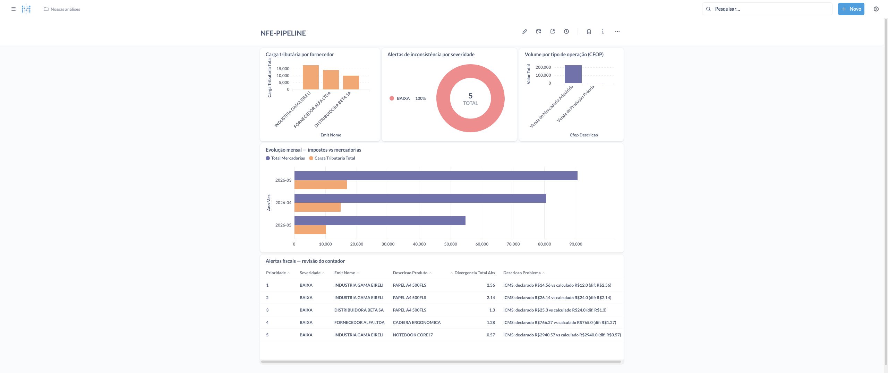
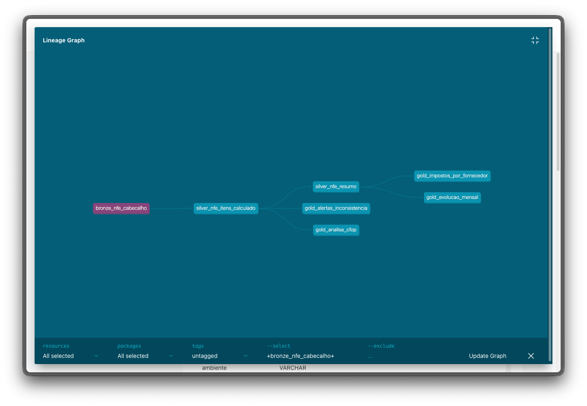
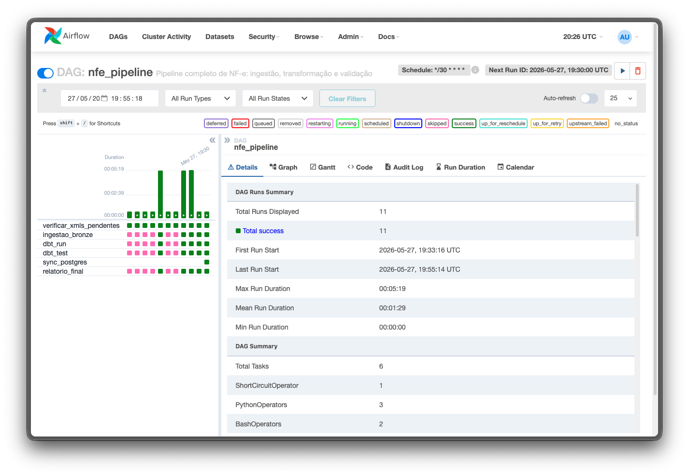

# 🧾 Pipeline de NF-e — Engenharia de Dados Fiscal

Pipeline completo de processamento de Notas Fiscais Eletrônicas (NF-e), construído com as principais ferramentas do mercado de engenharia de dados. O projeto automatiza a extração, transformação e análise fiscal de XMLs de NF-e, detectando inconsistências tributárias e gerando visões analíticas para uso contábil.

---

## 📸 Visão Geral

### Dashboard Fiscal (Metabase)


### Linhagem de Dados (dbt)


### Orquestração (Airflow)


---

## 🏗️ Arquitetura

O projeto segue a arquitetura **Medallion** (Bronze → Silver → Gold), padrão consolidado no mercado de dados:

```
XMLs de NF-e
     │
     ▼
┌─────────────┐
│  INGESTÃO   │  Python (lxml) — parse dos XMLs para estrutura tabular
└──────┬──────┘
       │
       ▼
┌─────────────┐
│   BRONZE    │  DuckDB — dados brutos, sem transformação, com controle de idempotência
└──────┬──────┘
       │
       ▼
┌─────────────┐
│   SILVER    │  dbt — recálculo de impostos, detecção de inconsistências, classificação CFOP/NCM
└──────┬──────┘
       │
       ▼
┌─────────────┐
│    GOLD     │  dbt — visões analíticas agregadas por fornecedor, CFOP e período
└──────┬──────┘
       │
       ▼
┌─────────────┐
│  DASHBOARD  │  Metabase — painéis fiscais para o contador
└─────────────┘

Toda a orquestração é feita pelo Apache Airflow (DAG com 6 tasks, schedule a cada 30 min)
```

---

## 🛠️ Stack

| Camada | Ferramenta | Versão |
|---|---|---|
| Linguagem | Python | 3.12 |
| Orquestração | Apache Airflow | 2.9.1 |
| Transformação | dbt-duckdb | 1.8.1 |
| Banco analítico | DuckDB | 0.10.2 |
| Banco de visualização | PostgreSQL | 15 |
| Dashboard | Metabase | 0.49.6 |
| Containerização | Docker + Docker Compose | — |
| Parse de XML | lxml | 5.2.2 |
| Manipulação de dados | pandas | 2.2.2 |

---

## ⚙️ Funcionalidades

### Ingestão (Camada Bronze)
- Parse de XMLs de NF-e (padrão SEFAZ 4.00) com `lxml`
- Extração de cabeçalho, itens e totais
- Controle de idempotência via tabela `arquivos_processados` — nenhum XML é reprocessado
- Suporte a múltiplos emitentes e destinatários

### Transformação (Camada Silver)
- **Recálculo automático de ICMS, PIS e COFINS** com base nas alíquotas declaradas
- **Detecção de inconsistências** por comparação entre valor declarado e calculado (tolerância de R$ 0,02)
- **Classificação de CFOP** em categorias legíveis (Saída Estadual, Saída Interestadual, Devolução etc.)
- **Categorização de NCM** por capítulo (Máquinas, Eletrônicos, Móveis etc.)
- Flags de qualidade por item e por nota

### Análise (Camada Gold)
- `gold_impostos_por_fornecedor` — carga tributária consolidada por emitente
- `gold_alertas_inconsistencia` — lista priorizada por severidade para revisão do contador
- `gold_evolucao_mensal` — série histórica de volume e impostos mês a mês
- `gold_analise_cfop` — distribuição de operações fiscais por tipo

### Orquestração (Airflow DAG)
```
verificar_xmls_pendentes
         │
         ▼
   ingestao_bronze
         │
         ▼
       dbt_run
         │
         ▼
      dbt_test
         │
         ▼
   sync_postgres
         │
         ▼
   relatorio_final
```

---

## 📁 Estrutura do Projeto

```
nfe-pipeline/
├── docker-compose.yml          # Airflow + PostgreSQL + Metabase
├── Dockerfile                  # Imagem customizada do Airflow
├── requirements.txt
├── README.md
├── dags/
│   └── nfe_pipeline_dag.py     # DAG principal (6 tasks)
├── dbt/
│   └── nfe_pipeline/
│       └── models/
│           ├── bronze/         # Views sobre as tabelas brutas
│           ├── silver/         # Regras fiscais e validações
│           └── gold/           # Agregações analíticas
├── ingestion/
│   ├── xml_parser.py           # Parse dos XMLs de NF-e
│   ├── loader.py               # Carga no DuckDB (Bronze)
│   ├── sync_to_postgres.py     # Sincronização Gold → PostgreSQL
│   └── run_bronze.py           # Ponto de entrada manual
├── data/
│   ├── raw/                    # XMLs para processamento (não versionado)
│   └── samples/                # XMLs de exemplo para desenvolvimento
└── tests/
    └── test_parser.py
```

---

## 🚀 Como Executar

### Pré-requisitos
- Docker Desktop
- Python 3.10+
- Git

### 1. Clone o repositório

```bash
git clone https://github.com/luanbalves/nfe-pipeline.git
cd nfe-pipeline
```

### 2. Instale as dependências Python

```bash
pip install -r requirements.txt
```

### 3. Configure o dbt

Cria o arquivo `~/.dbt/profiles.yml`:

```yaml
nfe_pipeline:
  target: dev
  outputs:
    dev:
      type: duckdb
      path: /opt/airflow/data/nfe_pipeline.duckdb
      threads: 4
```

### 4. Suba o ambiente Docker

```bash
docker compose up airflow-init
docker compose up -d
```

Serviços disponíveis:
- **Airflow UI** → http://localhost:8080 (admin / admin)
- **Metabase** → http://localhost:3000

### 5. Gere os dados de exemplo

```bash
python3 data/samples/generate_samples.py
cp data/samples/*.xml data/raw/
```

### 6. Dispare o pipeline

Na UI do Airflow, ative a DAG `nfe_pipeline` e clique em **Trigger DAG**.

---

## 📊 Dados de Exemplo

O projeto inclui um gerador de NF-es fictícias com estrutura 100% compatível com o padrão SEFAZ 4.00:

- **20 notas** com 3 fornecedores e 2 destinatários
- **15 notas normais** e **5 com inconsistências de ICMS intencionais**
- Produtos com NCMs e CFOPs reais
- Datas distribuídas nos últimos 90 dias

---

## 🧪 Testes

```bash
# Testes unitários do parser
pytest tests/

# Testes de qualidade dos dados (dbt)
cd dbt/nfe_pipeline
dbt test
```

---

## 📖 Documentação dbt

O dbt gera documentação automática com linhagem de dados:

```bash
cd dbt/nfe_pipeline
dbt docs generate
dbt docs serve --port 8081
```

Acesse http://localhost:8081 para visualizar o grafo de linhagem completo.

---

## 💡 Decisões Técnicas

**Por que DuckDB?** Banco OLAP embarcado, sem necessidade de servidor, ideal para pipelines locais e de médio volume. Performance analítica muito superior ao SQLite.

**Por que dbt?** Transforma dados com SQL versionado, gera documentação automática e testes de qualidade declarativos. Padrão crescente no mercado de dados.

**Por que arquitetura Medallion?** Separa responsabilidades: Bronze preserva os dados originais intactos, Silver aplica regras de negócio, Gold entrega visões prontas para consumo. Facilita rastreabilidade e reprocessamento.

**Por que idempotência no loader?** Pipelines de dados precisam ser seguros para reexecução. A tabela `arquivos_processados` garante que falhas parciais não causem duplicação de dados.

---

## 📄 Licença

MIT